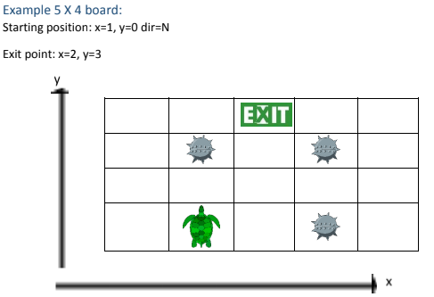
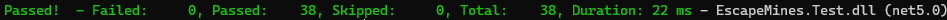

# EscapeMines

**EscapeMines** is a console application that reads the initial game settings from a file that includes the settings and sequence of actions.

## Used Technologies

-   **.NET 5**
-   **xunit 2.4.1**

## Setup

-   The board (or minefield) is a grid of N by M number of tiles.
-   The starting position is a tile, represented by a set of zero based coordinates (x, y) and the initial
    direction (i.e.: N, S, W or E).
-   The exit point is a tile (x, y)
-   The mines are defined as a list of tiles (x, y)



## Settings

The game settings are loaded from a **_commands.txt_** that is under EscapeMines.ConsoleApp folder, which should follow this format:

-   The first line of the file should define the board size.
-   The second line of the file should contain a list of mines (i.e. list of coordinates separated by a space).
-   The third line of the file should contain the exit point.
-   The fourth line of the file should contain the starting position of the turtle.
-   The fifth line and the following lines of the file should contain a series of actions.

#### Example Settings

```
5 4
1,1 1,3 3,3
4 2
0 1 N
R M L M M
R M M M
```

### Actions

Turtle Actions can be either:

-   **Move** - A move to the next neighbouring tile.
-   **Rotate** - A rotation (90 degrees Right or Left).

### Results

Results can be:

-   **Success** – if the turtle finds the exit point.
-   **Mine Hit** – if the turtle hits a mine.
-   **Still in Danger** – if the turtle has not yet found the exit or hit a mine.

#### Test Results


